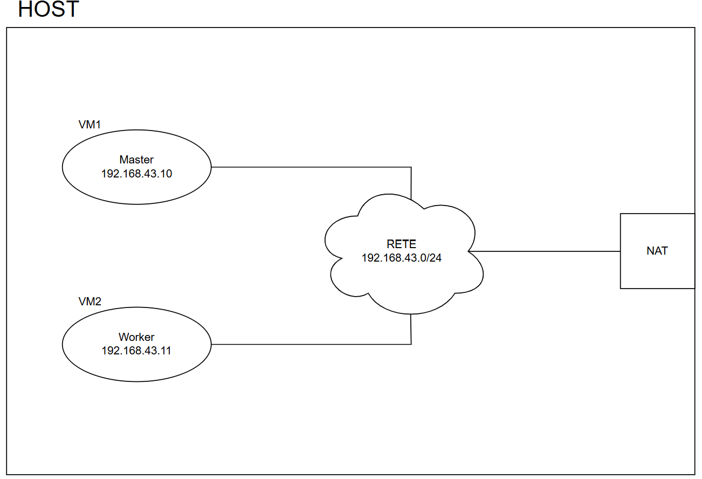
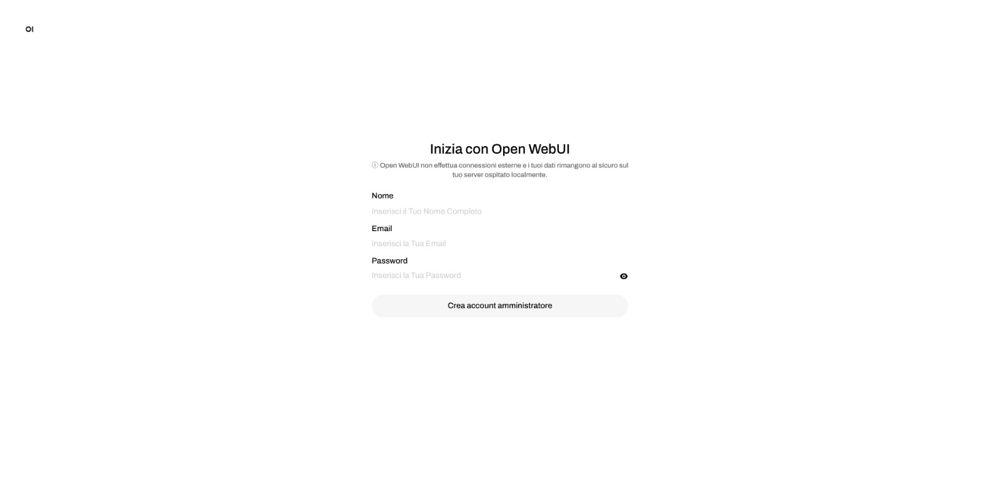
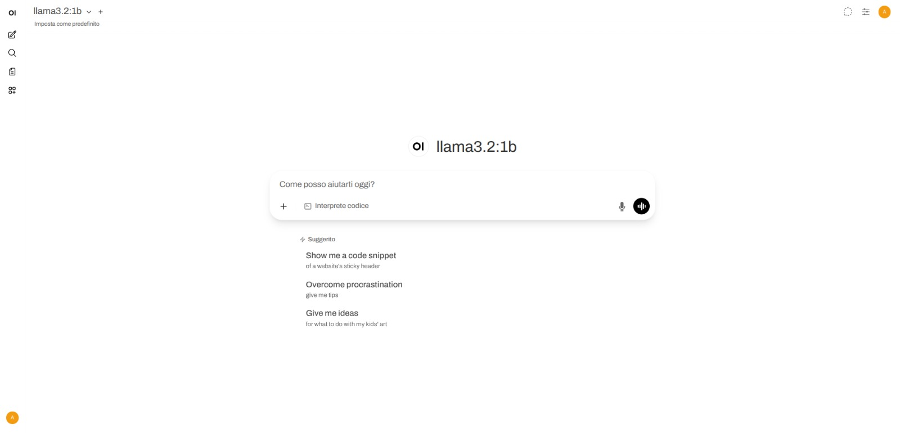
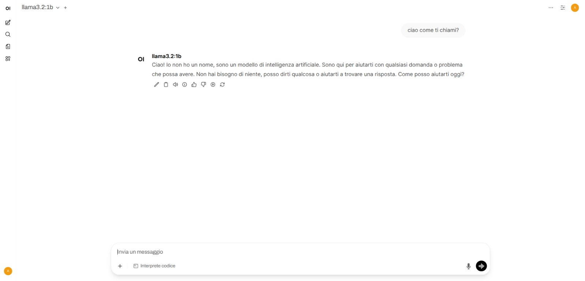
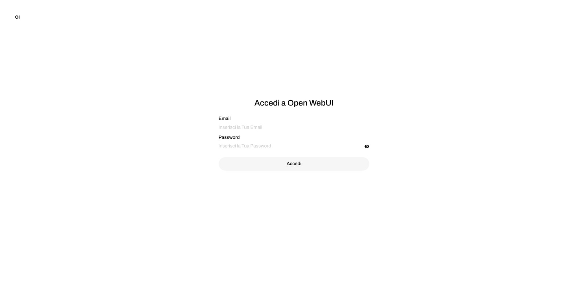

# Deployment di Llama, Ollama e Open WebUI su cluster Kubernetes
## Descrizione del progetto
Il progetto consiste nel deployment di [**llama3.2:1b**](https://ollama.com/library/llama3.2:1b), [**Ollama**](https://ollama.com/) e [**Open WebUI**](https://openwebui.com/) su un cluster Kubernetes.  
1. **llama3.2:1b** è un large language model rilasciato da Meta. Si tratta di un modello leggero, con circa 1 miliardo di parametri.
2. **Ollama** è un framework per l'esecuzione di large language model. Reso accessibile attraverso un servizio Kubernetes, rappresenta il backend della nostra applicazione. Espone delle API attraverso cui è possibile scaricare modelli e interrogarli.
3. **Open WebUI** è un'interfaccia web per interagire con large language model. Accessibile anch'essa attraverso un servizio Kubernetes, rappresenta il frontend dell'applicazione, interagendo con il backend Ollama mediante chiamate HTTP alle sue API.


## Architettura del cluster

Il cluster Kubernetes è costituito da due macchine virtuali Lubuntu 25.04, sulle quali è installato Kubernetes v1.32.0. 
Le due macchine virtuali sono connesse ad una rete con NAT gestita da VirtualBox. Una delle due macchine ospita il nodo master, l'altra il nodo worker del cluster Kubernetes:
* **master** (`192.168.43.10`)
* **worker** (`192.168.43.11`)



## 0. Clone della repository

```bash
git clone https://github.com/alessandro-tedeschi/llama-ollama-openwebui-on-k8s.git
cd llama-ollama-openwebui-on-k8s
```

## 1. Deployment di Ollama (backend)

Creazione del **Namespace** in cui verranno definite tutte le risorse relative a questo progetto:

`ollama/ollama_ns.yaml`:

```yaml
apiVersion: v1
kind: Namespace
metadata:
  name: ollama
```
Eseguire il comando
```bash
kubectl apply -f ollama/ollama_ns.yaml
```

Creazione di **PersistentVolume** e **PersistentVolumeClaim** per la persistenza dei dati di Ollama, tra cui i modelli stessi.

`ollama/ollama_pvc.yaml`:

```yaml
apiVersion: v1
kind: PersistentVolume
metadata:
  name: ollama-pv
spec:
  capacity:
    storage: 10Gi
  accessModes:
    - ReadWriteOnce
  persistentVolumeReclaimPolicy: Retain
  hostPath:
    path: /mnt/data/ollama
    type: DirectoryOrCreate
  claimRef:
    namespace: ollama
    name: ollama-pvc  
---
apiVersion: v1
kind: PersistentVolumeClaim
metadata:
  name: ollama-pvc
  namespace: ollama
spec:
  accessModes:
    - ReadWriteOnce
  resources:
    requests:
      storage: 10Gi
```
Eseguire il comando
```bash
kubectl apply -f ollama/ollama_pvc.yaml
```

Creazione del **Deployment** e del **Service** per Ollama.

`ollama/ollama_deploy.yaml`:

```yaml
apiVersion: apps/v1
kind: Deployment
metadata:
  name: ollama
  namespace: ollama
  labels:
    app: ollama
spec:
  replicas: 1
  selector:
    matchLabels:
      app: ollama
  template:
    metadata:
      labels:
        app: ollama
    spec:
      containers:
      - name: ollama
        image: ollama/ollama:latest
        ports:
        - containerPort: 11434
        resources:
          requests:
            cpu: 1000m
            memory: 2Gi
          limits:
            cpu: 2000m
            memory: 3Gi
        volumeMounts:
        - name: models
          mountPath: /root/.ollama
      volumes:
      - name: models
        persistentVolumeClaim:
          claimName: ollama-pvc
```

`ollama/ollama_service.yaml`:

```yaml
apiVersion: v1
kind: Service
metadata:
  name: ollama
  namespace: ollama
spec:
  type: NodePort
  selector:
    app: ollama
  ports:
  - port: 11434            
    nodePort: 31434
```

Eseguire i comandi:
```bash
kubectl apply -f ollama/ollama_deploy.yaml
```
```bash
kubectl apply -f ollama/ollama_service.yaml
```

Per verificare:
```bash
kubectl get pods -n ollama
```
```bash
kubectl get svc -n ollama
```

## 3. Deployment di llama3.2:1b

Sfruttiamo le API di Ollama per scaricare il modello llama3.2:1b. Lo facciamo tramite un **Job**:

`ollama/ollama_load-model-job.yaml`:

```yaml
apiVersion: batch/v1
kind: Job
metadata:
  name: load-model
  namespace: ollama
spec:
  template:
    spec:
      restartPolicy: OnFailure
      containers:
      - name: curl
        image: curlimages/curl
        command: ["/bin/sh", "-c"]
        args:
          - |
            until curl -sf http://ollama:11434; do
              echo "Waiting for ollama..."; sleep 2;
            done &&
            curl -X POST http://ollama:11434/api/pull \
              -H 'Content-Type: application/json' \
              -d '{"name": "llama3.2:1b"}'
```
Eseguire il comando:
```bash
kubectl apply -f ollama/ollama_load-model-job.yaml
```
Per verificare:
```bash
kubectl get pods -n ollama
```
```bash
kubectl get svc -n ollama
```

A questo punto, è già possibile interrogare il modello via cURL dal terminale di uno dei nodi, sfruttando le API esposte da Ollama.

La chiamata può essere fatta a IP e porta del nodo (porta relativa al servizio `ollama`, ovvero il valore `spec.ports.nodePort` in `ollama/ollama_service.yaml`):
```bash
curl http://<NodeIP>:31434/api/generate -d '{
  "model": "llama3.2:1b",
  "prompt": "Ciao",
  "stream": false
}'
```
Nel nostro cluster, gli indirizzi IP dei nodi sono `192.168.43.10` e `192.168.43.11`.
In alternativa, si può usare ClusterIP e porta del servizio (`spec.ports.port` in `ollama/ollama_service.yaml`)
```bash
curl http://<ClusterIP>:11434/api/generate -d '{
  "model": "llama3.2:1b",
  "prompt": "Ciao",
  "stream": false
}'
```
dove il ClusterIP del servizio `ollama` è visualizzabile mediante:
```bash
kubectl get svc -n ollama
```
Esempio di risposta alla cURL precedente:
`{"model":"llama3.2:1b","created_at":"2025-08-22T19:10:36.843486191Z","response":"Ciao! Come stai?","done":true,"done_reason":"stop","context":[128006,9125,128007,271,38766,1303,33025,2696,25,6790,220,2366,18,271,128009,128006,882,128007,271,34,23332,128009,128006,78191,128007,271,34,23332,0,15936,357,2192,30],"total_duration":12147366531,"load_duration":7292834395,"prompt_eval_count":27,"prompt_eval_duration":2850983780,"eval_count":8,"eval_duration":2000574667}`

## 4. Open WebUI

Creazione di **PersistentVolume** e **PersistentVolumeClaim** necessari per la persistenza di conversazioni e credenziali:

`openwebui/openwebui_pvc.yaml`:

```yaml
apiVersion: v1
kind: PersistentVolume
metadata:
  name: openwebui-pv
spec:
  capacity:
    storage: 5Gi
  accessModes:
    - ReadWriteOnce
  persistentVolumeReclaimPolicy: Retain
  hostPath:
    path: /mnt/data/openwebui
    type: DirectoryOrCreate
  claimRef:
    namespace: ollama
    name: openwebui-pvc
---
apiVersion: v1
kind: PersistentVolumeClaim
metadata:
  name: openwebui-pvc
  namespace: ollama
spec:
  accessModes:
    - ReadWriteOnce
  resources:
    requests:
      storage: 5Gi                                              
```
Eseguire il comando:
```bash
kubectl apply -f openwebui/openwebui_pvc.yaml
```
Creazione di **Deployment** e **Service** di tipo LoadBalancer per Open WebUI. Come LoadBalancer è stato utilizzato [MetalLB](https://metallb.io/).

`openwebui/openwebui_deploy.yaml`:

```yaml
apiVersion: apps/v1
kind: Deployment
metadata:
  name: open-webui
  namespace: ollama
  labels:
    app: open-webui
spec:
  replicas: 1
  selector:
    matchLabels:
      app: open-webui
  template:
    metadata:
      labels:
        app: open-webui
    spec:
      containers:
      - name: open-webui
        image: ghcr.io/open-webui/open-webui:main
        ports:
        - containerPort: 8080
        env:
        - name: OLLAMA_BASE_URL
          value: "http://ollama:11434"
        volumeMounts:
          - name: webui-data
            mountPath: /app/backend/data
        resources:
          requests:
            cpu: 1000m
            memory: 128Mi
          limits: 
            cpu: 2000m
            memory: 1Gi
      volumes:
      - name: webui-data
        persistentVolumeClaim:
          claimName: openwebui-pvc
```

`openwebui/openwebui_service.yaml`:

```yaml
apiVersion: v1
kind: Service
metadata:
  name: open-webui
  namespace: ollama
spec:
  type: LoadBalancer
  selector:
    app: open-webui
  ports:
  - port: 8080
    nodePort: 31808
```

Eseguire i comandi:

```bash
kubectl apply -f openwebui/openwebui_deploy.yaml
```

```bash
kubectl apply -f openwebui/openwebui_service.yaml
```
Per testare:
```bash
kubectl get pods -n ollama
```
```bash
kubectl get svc -n ollama
```
---

Ora è possibile accedere al servizio Open WebUI tramite browser da una delle due VM all’URL:
```
http://<ExternalIP>:<8080>
```
dove ExternalIP è l'indirizzo IP esterno del LoadBalancer, visualizzabile attraverso:
```bash
kubectl get svc -n ollama
```
e 8080 è la porta definita in `spec.ports.port` in `openwebui/openwebui_service.yaml`

## 5. Test dell'applicazione

Una volta acceduto via browser al suddetto URL, per poter utilizzare Open WebUI è necessario creare un account amministratore:



A questo punto, è possibile chattare con l'LLM. L'interfaccia consente anche di selezionare il modello.





Successivamente si può accedere con le credenziali precedentemente create:



avendo così la possibilità di creare una nuova chat o di accedere allo storico delle chat, che possono essere proseguite, rinominate o eliminate.
